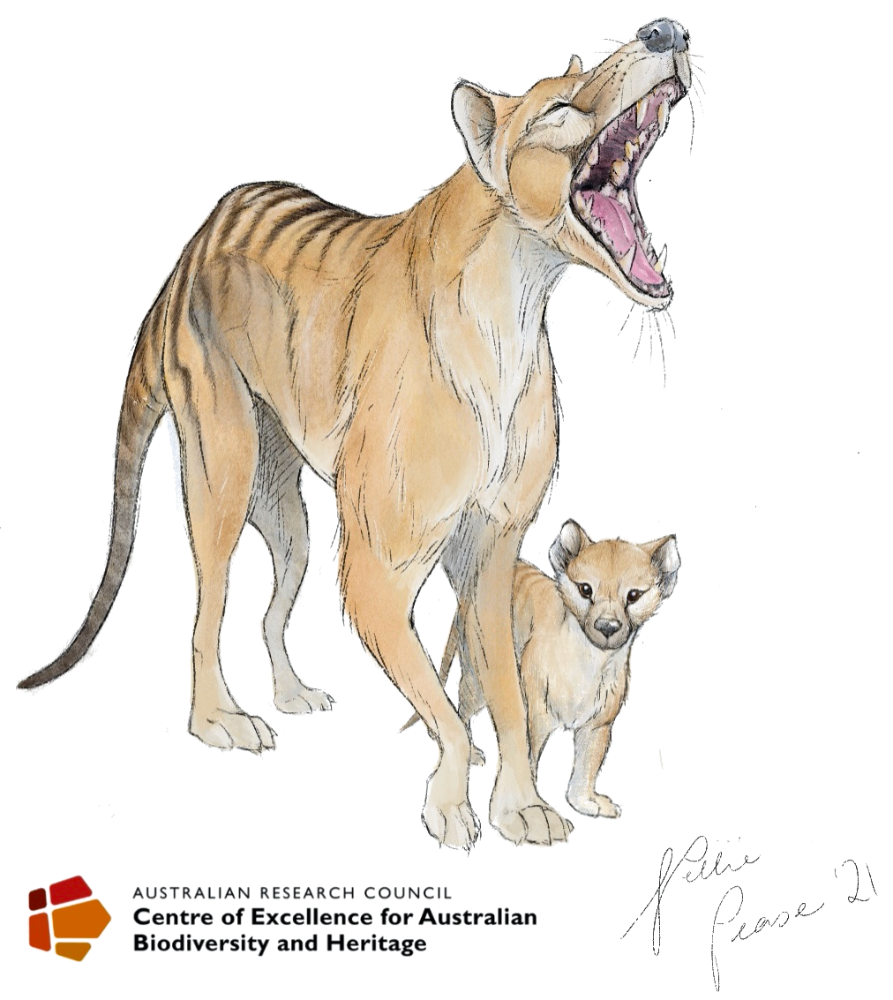

# Megafauna Susceptibility

R code accompanies article: 

<a href="http://www.flinders.edu.au/people/corey.bradshaw">BRADSHAW, CJA</a>, <a href="https://www.utas.edu.au/profiles/staff/biological-sciences/chris-johnson">CN JOHNSON</a>, <a href="http://www.flinders.edu.au/people/john.llewelyn">J LLEWELYN</a>, <a href="https://researchnow.flinders.edu.au/en/persons/vera-weisbecker">V WEISBECKER</a>, <a href="https://researchportal.helsinki.fi/en/persons/giovanni-strona">G STRONA</a>, <a href="http://www.flinders.edu.au/people/frederik.saltre">F SALTRÉ</a>. 2021. Relative demographic susceptibility does not explain the extinction chronology of Sahul’s megafauna. <i>eLife</i> 10: e63870. doi:<a href="http://doi.org/10.7554/eLife.63870">10.7554/eLife.63870</a>

<strong>AIM</strong>: construct plausible stochastic demographic models for main Sahul megafauna to determine relative demographic susceptibility to environmental change & novel predation (human) sources

## Abstract
The causes of Sahul’s megafauna extinctions remain uncertain, although several interacting factors were likely responsible. To examine the relative support for hypotheses regarding plausible ecological mechanisms underlying these extinctions, we constructed the first stochastic, age-structured models for 13 extinct megafauna species from five functional/taxonomic groups, as well as 8 extant species within these groups for comparison. Perturbing specific demographic rates individually, we tested which species were more demographically susceptible to extinction, and then compared these relative sensitivities to the fossil-derived extinction chronology. Our models show that the macropodiformes were the least demographically susceptible to extinction, followed by carnivores, monotremes, vombatiform herbivores, and large birds. Five of the eight extant species were as or more susceptible than the extinct species. There was no clear relationship between extinction susceptibility and the extinction chronology for any perturbation scenario, while body mass and generation length explained much of the variation in relative risk. Our results reveal that the actual mechanisms leading to the observed extinction chronology were unlikely related to variation in demographic susceptibility per se, but were possibly driven instead by finer-scale variation in climate change and/or human prey choice and relative hunting success.

 
Prof <a href="http://scholar.google.com.au/citations?sortby=pubdate&hl=en&user=1sO0O3wAAAAJ&view_op=list_works">Corey J. A. Bradshaw</a>  
<a href="http://globalecologyflinders.com" target="_blank">Global Ecology</a>, <a href="http://flinders.edu.au" target="_blank">Flinders University</a>, Adelaide, Australia  
August 2020  
<a href=mailto:corey.bradshaw@flinders.edu.au>e-mail</a>  

## Groups/genera modelled
- <strong>VOMBATIFORM HERBIVORES</strong>: <a href="https://australian.museum/learn/australia-over-time/extinct-animals/diprotodon-optatum/"><i>Diprotodon</i></a> (†), <a href="https://australian.museum/learn/animals/mammals/palorchestes-azeal/"><i>Palorchestes</i></a> (†), <a href="http://www.megafauna.com.au/view/megafauna/zygomaturus-trilobus"><i>Zygomaturus</i></a> (†), <a href="http://www.seamonsters.qm.qld.gov.au/sitecore/content/QM%20Micro/Project%20DIG/Home/research/tropical-megafauna/species/phascolonus"><i>Phascolonus</i></a> (†), <a href="https://australian.museum/learn/animals/mammals/common-wombat/"><i>Vombatus ursinus</i></a> 
- <strong>MACROPODIFORM HERBIVORES</strong>: <a href="http://www.seamonsters.qm.qld.gov.au/sitecore/content/QM%20Micro/Project%20DIG/Home/research/tropical-megafauna/species/protemnodon"><i>Protemnodon</i></a> (†), <a href="https://australian.museum/learn/animals/mammals/red-kangaroo/"><i>Osphranter rufus</i></a>, <a href="https://en.wikipedia.org/wiki/Sthenurus"><i>Sthenurus</i></a> (†), <a href="http://www.megafauna.com.au/view/megafauna/simosthenurus-occidentalis"><i>Simosthenurus</i></a> (†), <a href="https://australian.museum/learn/australia-over-time/extinct-animals/procoptodon-goliah/"><i>Procoptodon</i></a> (†), <a href="https://en.wikipedia.org/wiki/Sthenurinae"><i>Metasthenurus</i></a> (†), <a href="https://bie.ala.org.au/species/urn:lsid:biodiversity.org.au:afd.taxon:4bd05bcb-614d-40b0-b81f-75ac14ea4afd"><i>Notamacropus</i></a> 
- <strong>LARGE BIRDS</strong>: <a href="https://australian.museum/learn/australia-over-time/extinct-animals/genyornis-newtoni/"><i>Genyornis</i></a> (†), <a href="https://www.birdlife.org.au/bird-profile/emu"><i>Dromaius novaehollandiae</i></a>, <a href="https://www.birdlife.org.au/bird-profile/australian-brush-turkey"><i>Alectura lathami</i></a> 
- <strong>CARNIVORES</strong>: <a href="https://australian.museum/learn/animals/mammals/tasmanian-devil/"><i>Sarcophilus</i></a>, <a href="https://australian.museum/learn/australia-over-time/extinct-animals/the-thylacine/"><i>Thylacinus</i></a> (†), <a href="https://australian.museum/learn/animals/mammals/thylacoleo-carnifex/"><i>Thylacoleo</i></a> (†), <a href="https://australian.museum/learn/animals/mammals/spotted-tailed-quoll/"><i>Dasyurus</i></a> 
- <strong>MONOTREMES</strong>: <a href="https://www.artistwd.com/joyzine/australia/articles/megafauna/megalibgwilia_ramsayi.php"><i>Megalibgwilia</i></a> (†), <a href="https://www.bushheritage.org.au/species/echidna"><i>Tachyglossus</i></a>

## Demographic parameters for each species summarised below (<a href="https://elifesciences.org/articles/63870#app2table1">Appendix 2, table 1</a> in the <a href="http://doi.org/10.7554/eLife.63870">original article</a>)

## Repository includes the following files

- <a href="https://github.com/cjabradshaw/MegafaunaSusceptibility/blob/master/Sahul%20megafauna%20demographic%20susceptibility-base%20models.R"><code>Sahul megafauna demographic susceptibility-base models.R</code></a> — constructs bases models for all perturbation scenarios (must be run first)
- <a href="https://github.com/cjabradshaw/MegafaunaSusceptibility/blob/master/matrixOperators.r"><code>matrixOperators.R</code></a> — functions to manipulate matrix models
- <a href="https://github.com/cjabradshaw/MegafaunaSusceptibility/blob/master/megsuscept.SCENARIO2.juvsurv.R"><code>megsuscept.SCENARIO2.juvsurv.R</code></a> — runs Scenario 2 (reduction in juvenile survival)
- <a href="https://github.com/cjabradshaw/MegafaunaSusceptibility/blob/master/megsuscept.SCENARIO3.fertred.R"><code>megsuscept.SCENARIO3.fertred.R</code></a> — runs Scenario 3 (reduction in fertility)
- <a href="https://github.com/cjabradshaw/MegafaunaSusceptibility/blob/master/megsuscept.SCENARIO4.survred.R"><code>megsuscept.SCENARIO4.survred.R</code></a> — runs Scenario 4 (reduction in all-ages survival)
- <a href="https://github.com/cjabradshaw/MegafaunaSusceptibility/blob/master/megsuscept.SCENARIO5.indrem.R"><code>megsuscept.SCENARIO5.indrem.R</code></a> — runs Scenario 5 (increasing individual offtake)
- <a href="https://github.com/cjabradshaw/MegafaunaSusceptibility/blob/master/megsuscept.SCENARIO6.catinc.R"><code>megsuscept.SCENARIO6.catinc.R</code></a> — runs Scenario 6 (increasing frequency of catastrophic die-offs)
- <a href="https://github.com/cjabradshaw/MegafaunaSusceptibility/blob/master/megsuscept.SCENARIO7.catMinc.R"><code>megsuscept.SCENARIO7.catMinc.R</code></a> — runs Scenario 7 (increasing magnitude of catastrophic die-offs)

** NOTE: For Scenario 7, Scenario 6 must be run first to create input .csv file 'catincQpr.csv' **

## Sensitivity analysis
- <a href="https://github.com/cjabradshaw/MegafaunaSusceptibility/blob/master/GRIWM.jk.sensitivity.R"><code>GRIWM.jk.sensitivity.R</code></a> — is the Gaussian-Resampled, Inverse-Weighted McInerny (GRIWM) Signor-Lipps algorithm, including a jack-knife estimator to test senstivity of dates to different assumptions. This R code is applied to the various chronologies for the following taxa (.csv files in the '<a href="https://github.com/cjabradshaw/MegafaunaSusceptibility/tree/master/chronologies">chronologies</a>' sub-folder): <i>Diprotodon</i>, <i>Palorchestes</i>, <i>Zygomaturus</i>, <i>Phascolonus</i>, <i>Protemnodon</i>, <i>Sthenurus</i>, <i>Simosthenurus</i>, <i>Procoptodon</i>, <i>Metasthenurus</i>, <i>Genyornis</i>, <i>Thylacoleo</i>, <i>Megalibgwilia</i>
